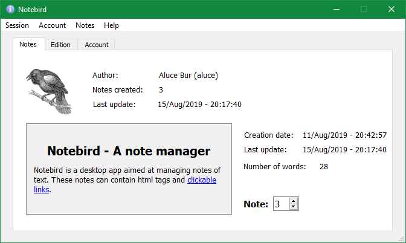
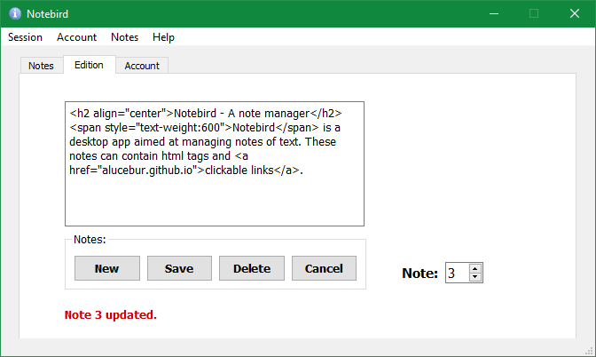

<h2 align="center">Notebird - A note manager</h2>

Notebird is a desktop app aimed at managing notes of text. These notes can contain html tags and clickable links. The app could be ported to a larger database such as PostgreSQL or Oracle by modifying the `dbhelper` module.

This is my first project using the Qt framework and was solely done for learning purposes. User interfaces were created with the Qt Creator software, and they are loaded dinamically using PySide2.

- [How to use the app?](#how-to-use)
- [Which modules were used?](#modules-used)
- [Which are the requirements?](#requirements)
- [How can I install it?](#installation)
- [How does it look?](#screenshots)
- [Structure](#structure)
- [License](#license)

---

### How to use
The app starts at the `login` window. To use the application the user needs to have created an account at the `sign up` window. With said account, the user logs in the app at the `login` window, and the main window (`crud` window) is displayed.

The `crud` window is divided in 3 tabs:
- The main one displays the first note created by the user, if any, along with some metadata. The user can go across the rest of their notes using the spinner.
- The second tab lets the user update, delete, and create new notes. The user can select the note they want to edit using another spinner.
- Finally, the third tab allows the user to change their username, name or password (the current password is required to change any of these data). They can also change or delete their current avatar (no password required, images are stored as 175x175 png images under the `/avatars` folder).

---

### Modules used
- time - add metadata to the notes
- typing - type hinting
- logging - log relevant things happening in the app
- pathlib - create path to files independently of the OS used
- sqlite3 - lightweight database to store data
- passlib - hashed and salted passwords
- argparse - parse command line options
- PySide2 - python wrapper for the Qt framework
- pillow (PIL) - avatar creation

---

### Requirements
Requires Python 3.6+ (with pip).

---

### Installation
Clone the repository or download and extract the zip or tarball file in an empty folder on your computer.

Navigate until the recently created folder and install dependencies:

- Pipenv:

        pipenv install

- Pip:

        pip install -r requirements.txt

Run the application:

- Pipenv:

        pipenv run notebird/notebird.py

- Other:

        python notebird/notebird.py

If you prefer it, you can start the application in `dark mode`. To do so, run the program with the option `-d` or `--dark` (running the program with the option `-h` or `--help` will show the help):

        pipenv run notebird/notebird.py --dark
        python notebird/notebird.py --dark

This application uses the logging module to send info to standard output. By default the log level is set to DEBUG. You can change it to INFO editing this line in `notebird.py` as follow:
```python
    logging.basicConfig(format=format, level=logging.INFO)
```

---

### Screenshots





---

### Structure
```
├──  notebird
│    ├── db
│    │   ├── __init__.py
│    │   ├── dbhelper.py
│    │   └── helpers.py
│    ├── utils
│    │   ├── __init__.py
│    │   ├── consts.py
│    │   ├── custom_widgets.py
│    │   ├── exceptions.py
│    │   ├── pyside_dynamic.py
│    │   ├── security.py
│    │   └── validations.py
│    ├── windows
│    │   ├── avatars
│    │   │   └── 0.png
│    │   ├── interfaces
│    │   │   ├── assets
│    │   │   │   ├── icon.svg
│    │   │   │   ├── rubecula.png
│    │   │   │   ├── White_arrow_down.svg
│    │   │   │   ├── White_arrow_up.svg
│    │   │   │   └── White_dot.svg
│    │   │   ├── crud.ui
│    │   │   ├── login.ui
│    │   │   └── signup.ui
│    │   ├── __init__.py
│    │   ├── crud.py
│    │   ├── login.py
│    │   └── signup.py
│    ├── notebird.py
│    └── style.qss
├──  docs
│    ├── layouts
│    │   └── default.html
│    ├── screenshots
│    │   ├── avatar.png
│    │   ├── edition.png
│    │   ├── info.png
│    │   ├── login.png
│    │   ├── note.png
│    │   └── signup.png
│    ├── _config.yml
│    ├── 404.html
│    └── index.md
├──  .gitignore
├──  Pipfile
├──  Pipfile.lock
├──  readme.md
├──  requirements.txt
└──  UNLICENSE
```

- ./notebird
  - `notebird.py`: main module that initializes all the necessary stuff
  - `style.qss`: stylesheet for dark-mode

- ./notebird/db:
  - `dbhelper.py`: module to connect and operate with the database
  - `helpers.py`: module with functions to initialize database and close connection

  Inside this folder a SQLite database will be created at running time.

- ./notebird/utils:
  - `consts.py`: module with paths to different resources
  - `custom_widgets.py`: module with custom widget classes
  - `exceptions.py`: module with user-defined exceptions to abstract the database
  - `pyside_dynamic.py`: module to load a user interface dynamically with PySide2
  - `security.py`: module to operate with hashed and salted passwords
  - `validations.py`: module with functions to validate user inputs

- ./notebird/windows:
  - `crud.py`: module that loads the crud window where users can manage their data
  - `login.py`: module that loads the login window where users can log into the database
  - `signup.py`: module that loads the sign up window where users can create acccounts
  
  Avatars subfolder is used to store users' avatars, which are named after the users' ids.

- ./notebird/windows/interfaces:
  - `crud.ui`: user interface for the crud window
  - `login.ui`: user interface for the login window
  - `signup.ui`: user interface for the sign up window

  Assets subfolder contains images to be displayed by these ui files.

---

### License
The majority of this project code is Unlicensed, feel free to use it as you want. See exceptions below.

Images used for this project are under Public Domain:
- ***rubecula.png***: (modified from original) Allan Cox (@coxy34) in [unsplash.com](https://unsplash.com/photos/ptnG3jGVDQw) under Public Domain.
- ***icon.svg***: El_T in [wikipedia.org](https://en.wikipedia.org/wiki/File:Information_icon.svg) under Public Domain.
- ***0.png***: Clker-Free-Vector-Images in [pixabay.com](https://pixabay.com/vectors/blackbird-bird-wildlife-fauna-38066/) under Public Domain.
- ***White_arrow_up.svg***: Madecco in [wikipedia.org](https://commons.wikimedia.org/wiki/File:White_arrow_up.svg) under Public Domain.
- ***White_arrow_down.svg***: Madecco in [wikipedia.org](https://commons.wikimedia.org/wiki/File:White_arrow_down.svg) under Public Domain.
- ***White_dot.svg***: Sameboat in [wikipedia.org](https://en.wikipedia.org/wiki/File:White_dot.svg) under Public Domain.

***`pyside_dynamic`*** module is a copyrighted work by Sebastian Wiesner. It was modified to make it work with PySide2.

This is a copy of its corresponding MIT license:

Copyright (c) 2011 Sebastian Wiesner <lunaryorn@gmail.com>

Modifications by Charl Botha <cpbotha@vxlabs.com>
* customWidgets support (registerCustomWidget() causes segfault in
  pyside 1.1.2 on Ubuntu 12.04 x86_64)
* workingDirectory support in loadUi

Original version was here:
https://github.com/lunaryorn/snippets/blob/master/qt4/designer/pyside_dynamic.py

Current version is here:
https://gist.github.com/cpbotha/1b42a20c8f3eb9bb7cb8

Permission is hereby granted, free of charge, to any person obtaining a
copy of this software and associated documentation files (the "Software"),
to deal in the Software without restriction, including without limitation
the rights to use, copy, modify, merge, publish, distribute, sublicense,
and/or sell copies of the Software, and to permit persons to whom the
Software is furnished to do so, subject to the following conditions:

The above copyright notice and this permission notice shall be included in
all copies or substantial portions of the Software.

THE SOFTWARE IS PROVIDED "AS IS", WITHOUT WARRANTY OF ANY KIND, EXPRESS OR
IMPLIED, INCLUDING BUT NOT LIMITED TO THE WARRANTIES OF MERCHANTABILITY,
FITNESS FOR A PARTICULAR PURPOSE AND NONINFRINGEMENT. IN NO EVENT SHALL
THE AUTHORS OR COPYRIGHT HOLDERS BE LIABLE FOR ANY CLAIM, DAMAGES OR OTHER
LIABILITY, WHETHER IN AN ACTION OF CONTRACT, TORT OR OTHERWISE, ARISING
FROM, OUT OF OR IN CONNECTION WITH THE SOFTWARE OR THE USE OR OTHER
DEALINGS IN THE SOFTWARE.
